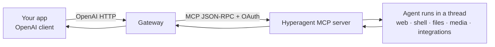

  · [🏠 README](../../README.md) · [📚 Index](00-index.md)

# Overview & concepts

This page explains the whole idea in plain language, then defines the key terms.
No prior experience assumed.

## The problem, in everyday words

Imagine two devices with different plugs:

- **Your app** speaks "OpenAI" — the most common way software asks an AI for
  answers.
- **Hyperagent** speaks "MCP" — its own way of letting outside programs drive its
  AI agents.

They can't plug into each other directly. This project is the **adapter** in the
middle: your app plugs in the OpenAI way, and the adapter quietly does the
Hyperagent thing on the other side.

## What each side is

### The OpenAI API (the plug your app already uses)
An **API** is a set of rules for programs to talk to a service over the internet.
The **OpenAI API** became a standard: send a list of chat messages to an
**endpoint** (a URL like `/v1/chat/completions`), get back the AI's reply. So many
tools support it that "OpenAI-compatible" is a feature category by itself.

### Hyperagent (the power behind the wall)
**Hyperagent.com** runs AI **agents**. An *agent* is more than a chatbot: it
works inside a **thread** (a persistent workspace) and can *do* things — search
the web, run code in a sandbox, drive a browser, generate images/audio, edit
files, and call integrations like GitHub or Slack.

Hyperagent's only public programmatic entrance is a **hosted MCP server**.
**MCP (Model Context Protocol)** is an open standard for connecting AI clients to
tools/services. Hyperagent's MCP server lets an outside program: list your agents,
start a thread, send follow-up messages, and read results.

## What the gateway does

The gateway is a small web server that:
1. **Receives** OpenAI-style requests from your app.
2. **Translates** them into Hyperagent MCP calls (start a thread, poll for the
   answer).
3. **Returns** the answer in exact OpenAI format — including streaming.

So you keep your OpenAI code; the "model" is now a Hyperagent agent.

## One crucial idea: two layers of "tools"

This trips people up, so read slowly:

- **Outer layer (what the gateway can call directly):** the 6 MCP tools —
  `list_agents`, `create_thread`, `send_message`, `get_thread`, `list_threads`,
  `create_attachment_upload`.
- **Inner layer (what the *agent* uses while it works):** the big toolbox —
  shell, file read/write, web search, browser, image/audio generation, tables,
  documents, maps, integrations.

The gateway cannot call the inner tools *directly*; instead the agent uses them
while running your request. The [tool bridge](05-tool-bridge.md) makes those inner
tools visible and controllable through OpenAI's standard `tools` / `tool_calls`.

## Why not just use OpenAI?

Because you specifically want **Hyperagent's abilities** behind the familiar
OpenAI interface: real web research, code execution, browser automation, media
generation, and your connected integrations — all driven by tools that already
speak OpenAI.

## Trade-offs to know up front

- It's **slower** than a raw model: every call runs a full agent pipeline.
- **Streaming is emulated** (the gateway polls and re-emits), not true token
  streaming.
- Some OpenAI knobs (`temperature`, `top_p`, `seed`) don't meaningfully apply and
  are accepted but ignored.

Next: [Quick start](02-quickstart.md) to run it yourself, or the
[Glossary](08-glossary.md) if any word above was unfamiliar.
