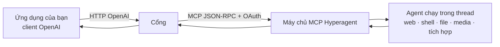

  · [🏠 README](../../README.vi.md) · [📚 Mục lục](00-index.md)

# Tổng quan & khái niệm

Trang này giải thích toàn bộ ý tưởng bằng lời đơn giản, rồi định nghĩa các thuật
ngữ chính. Không cần kiến thức nền.

## Vấn đề, nói theo kiểu đời thường

Hình dung hai thiết bị với hai loại phích cắm khác nhau:

- **Ứng dụng của bạn** nói "tiếng OpenAI" — cách phổ biến nhất để phần mềm hỏi AI.
- **Hyperagent** nói "tiếng MCP" — cách riêng của nó để chương trình bên ngoài
  điều khiển các agent AI.

Hai bên không cắm thẳng vào nhau được. Dự án này là **bộ chuyển đổi** ở giữa: ứng
dụng của bạn cắm vào theo kiểu OpenAI, còn bộ chuyển đổi âm thầm làm việc với
Hyperagent ở phía bên kia.

## Mỗi bên là gì

### API của OpenAI (cái phích ứng dụng bạn đang dùng)
**API** là bộ quy tắc để các chương trình nói chuyện với một dịch vụ qua Internet.
**API của OpenAI** đã thành chuẩn: gửi một danh sách tin nhắn chat tới một
**endpoint** (một URL như `/v1/chat/completions`), rồi nhận lại câu trả lời của
AI. Vì quá nhiều công cụ hỗ trợ nó nên "tương thích OpenAI" trở thành một nhóm
tính năng riêng.

### Hyperagent (nguồn sức mạnh phía sau tường)
**Hyperagent.com** vận hành các **agent** AI. *Agent* không chỉ là chatbot: nó
làm việc trong một **thread** (không gian làm việc bền bỉ) và có thể *hành động* —
tìm web, chạy code trong sandbox, điều khiển trình duyệt, tạo ảnh/âm thanh, sửa
file, và gọi các tích hợp như GitHub hay Slack.

Cửa lập trình công khai duy nhất của Hyperagent là một **máy chủ MCP**.
**MCP (Model Context Protocol)** là chuẩn mở để nối các "khách" AI với công
cụ/dịch vụ. Máy chủ MCP của Hyperagent cho phép chương trình bên ngoài: liệt kê
agent, mở thread, gửi tin nhắn tiếp theo, và đọc kết quả.

## Cổng làm gì

Cổng là một máy chủ web nhỏ:
1. **Nhận** yêu cầu kiểu OpenAI từ ứng dụng của bạn.
2. **Dịch** chúng thành lời gọi MCP của Hyperagent (mở thread, hỏi liên tục để lấy
   câu trả lời).
3. **Trả** kết quả đúng định dạng OpenAI — kể cả streaming.

Nhờ vậy bạn giữ nguyên code OpenAI; còn "mô hình" giờ là một agent Hyperagent.

## Một ý rất quan trọng: hai tầng "công cụ"

Chỗ này hay gây nhầm, đọc chậm nhé:

- **Tầng ngoài (cái cổng gọi trực tiếp được):** 6 công cụ MCP —
  `list_agents`, `create_thread`, `send_message`, `get_thread`, `list_threads`,
  `create_attachment_upload`.
- **Tầng trong (cái *agent* dùng khi làm việc):** hộp đồ nghề lớn — shell,
  đọc/ghi file, tìm web, trình duyệt, tạo ảnh/âm thanh, bảng, tài liệu, bản đồ,
  tích hợp.

Cổng **không** gọi trực tiếp tầng trong; agent mới dùng chúng khi chạy yêu cầu của
bạn. [Cầu nối công cụ](05-tool-bridge.md) giúp phơi bày và điều khiển tầng trong
này qua `tools` / `tool_calls` chuẩn OpenAI.

## Sao không dùng thẳng OpenAI?

Vì bạn muốn chính **năng lực của Hyperagent** đứng sau giao diện OpenAI quen
thuộc: tìm web thật, chạy code, điều khiển trình duyệt, tạo media, và các tích hợp
của bạn — tất cả điều khiển bằng công cụ vốn đã nói tiếng OpenAI.

## Vài đánh đổi cần biết trước

- **Chậm hơn** mô hình thuần: mỗi lần gọi chạy cả pipeline agent.
- **Streaming là mô phỏng** (cổng poll rồi phát lại), không phải nhả token thật.
- Vài núm của OpenAI (`temperature`, `top_p`, `seed`) không thực sự áp dụng, được
  chấp nhận nhưng bỏ qua.

Tiếp theo: [Bắt đầu nhanh](02-quickstart.md) để tự chạy, hoặc
[Thuật ngữ](08-glossary.md) nếu có từ nào ở trên còn lạ.
